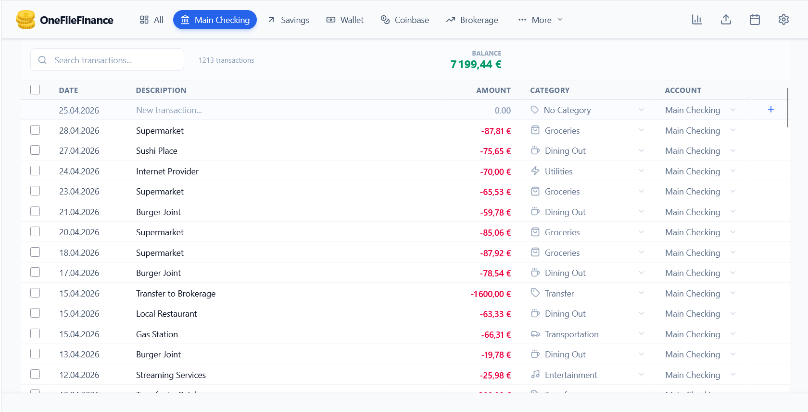

# OneFileFinance



**[Official Website](https://michaelber.github.io/OneFileFinance/)** | **[Online Live Demo](https://michaelber.github.io/OneFileFinance/dist/index.html)** | **[Download for Windows](https://github.com/michaelber/OneFileFinance/releases)** | **[Demo Data](https://michaelber.github.io/OneFileFinance/demodata.fin)**

OneFileFinance is a fast, local-first personal finance management application. It helps you track transactions, manage multiple accounts, categorize expenses, and visualize your financial health—all while keeping your data strictly secure on your own device.

## Features

*   **100% Private & Local-First Architecture:** Your financial data is stored locally in your browser using IndexedDB (via Dexie.js) or saved locally as a `.fin` file. Data never leaves your device unless you choose to export it.
*   **Advanced Reports:** Gain actionable insights with visually stunning P&L reports, comprehensive cashflow analysis, and net worth tracking.
*   **Excel-like Editing:** Easily add, modify, delete, and search transactions with a beautiful, agile data grid designed for power users.
*   **Deep Customization:** Setup arbitrary rules for auto-categorization. Design specific accounts, categories, and handle Opening Balances seamlessly.
*   **Batch Operations:** Select multiple transactions to quickly delete, recategorize, or move them between accounts.
*   **Cross-Platform Desktop App:** Built with Tauri, allowing you to compile the app into a lightweight, native desktop executable.

## Live Demo

Experience OneFileFinance instantly in your browser. Since it uses local storage, no backend setup, signup, or database provisioning is required to get started.

👉 **[Launch Live Demo](https://michaelber.github.io/OneFileFinance/dist/index.html)**

You can also download our **[Demo Data (`demodata.fin` file)](https://michaelber.github.io/OneFileFinance/demodata.fin)** and import it directly into the demo to explore a fully populated workspace!

## Development & Build Instructions

OneFileFinance can be run as a standard web application or compiled into a native desktop app using Tauri.

### Prerequisites

*   [Node.js](https://nodejs.org/) (v18 or newer)
*   [Rust](https://www.rust-lang.org/tools/install) (required for building the desktop app)
*   [Tauri Prerequisites](https://tauri.app/v1/guides/getting-started/prerequisites) (C++ build tools for Windows, etc.)

### Web Application

1. Install dependencies:
   ```bash
   npm install
   ```
2. Start the development server:
   ```bash
   npm run dev
   ```
3. Build for production (builds to `docs/dist/` suitable for GitHub Pages hosting, and automatically performs manual chunk optimization):
   ```bash
   npm run build
   ```

### Desktop Application (Tauri)

To build the standalone desktop executable (e.g., `.exe` for Windows):

1. Install project dependencies:
   ```bash
   npm install
   ```
2. Build the Tauri app (this automatically builds the Vite frontend inside `docs/dist` first):
   ```bash
   npm run tauri build
   ```
The compiled executable will be located in the `src-tauri/target/release/bundle/` directory.
